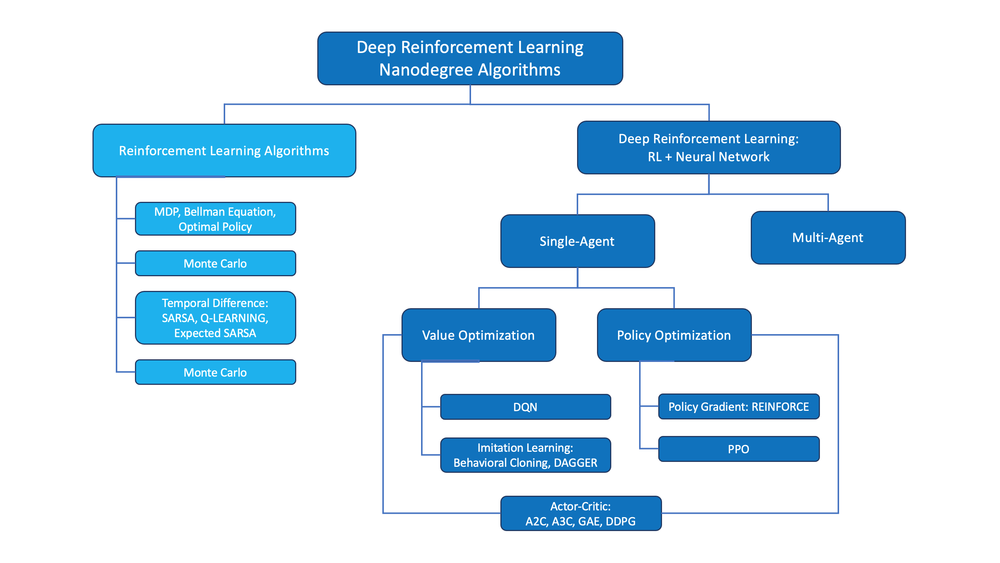

# Notes on Deep Reinforcement Learning Nanodegree

### Exploration-Exploitation Dilemma

- **Exploration**: Exploring potential hypotheses for how to choose actions
- **Exploitation**: Exploiting limited knowledge about what is already known should work well

### Comparison of State-Value Function and Action-Value Function

### Summary

